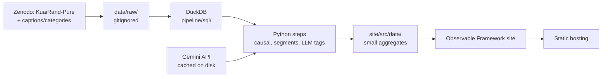

# KuaiRand feed analysis

Should a short-video feed boost under-distributed videos? This project prices the trade-off using KuaiRand's
randomly exposed impressions, and publishes the analysis as a static dashboard.

Site: suliahmed.com/projects/kuairand-analysis/ (in progress)

## Approach

- **Data:** KuaiRand-Pure, 27K users and 7.6K videos, with 1.2M impressions where the recommended video was replaced
  by a random one.
- **Metrics:** meaningful watch time per impression (north-star); early-skip rate, negative feedback and
  next-impression carryover as guardrails.
- **Causal design:** slot-level randomisation, two-way clustered inference, a constructed user-level readout with
  CUPED, segment effects, and power/MDE.
- **AI:** LLM content tags from video captions (vertical, format, commercial intent), checked against the
  platform's own categories and a blind audit by a second model, with the tagging error carried into the results.

Details: [`notes/01_data_profile.md`](notes/01_data_profile.md), [`notes/02_analysis_plan.md`](notes/02_analysis_plan.md).

## Architecture



## Run it

Requires Python 3.11+.

```bash
python3 -m venv .venv && source .venv/bin/activate
pip install -r requirements.txt
```

Download the data (raw files stay out of git):

```bash
mkdir -p data/raw
curl -L -o data/raw/KuaiRand-Pure.tar.gz https://zenodo.org/records/10439422/files/KuaiRand-Pure.tar.gz
tar -xzf data/raw/KuaiRand-Pure.tar.gz -C data/raw
python -m pipeline.fetch_supplementary
```

Profile the data:

```bash
python -m pipeline.profile
```

Run the analysis. The first run builds `data/kuairand.duckdb`; results go to `site/src/data/`.

```bash
python -m pipeline
```

The LLM tags are committed in `data/derived/llm_tags.csv`, so the analysis runs without an API key. To re-tag, put
`GEMINI_API_KEY` in `.env` (responses are cached in `data/cache/llm/`):

```bash
python -m pipeline.llm
```

Run the tests (A/A calibration, CUPED, cluster-robust SEs against statsmodels, misclassification correction):

```bash
pytest
```

## Layout

```
pipeline/        Python steps and SQL (pipeline/sql/)
tests/           statistical tests
notes/           data profile, analysis plan, audit labels (notes/hand_labels/)
data/raw/        downloaded data (gitignored)
data/derived/    LLM tags
site/            dashboard (Observable Framework)
```

## Licence and attribution

- **Code:** MIT.
- **Data and derived data:** KuaiRand by Chongming Gao et al.
  - Main dataset: [Zenodo 10439422](https://zenodo.org/records/10439422). The bundled `LICENSE` says CC BY-SA 4.0;
    the Zenodo record says CC BY 4.0. This project follows CC BY-SA 4.0.
  - Captions and categories: [Zenodo 18159199](https://zenodo.org/records/18159199), CC BY 4.0.
  - This project aggregates and transforms the data. Derived data files are released under CC BY-SA 4.0.

```bibtex
@inproceedings{gao2022kuairand,
  title     = {KuaiRand: An Unbiased Sequential Recommendation Dataset with Randomly Exposed Videos},
  author    = {Gao, Chongming and Li, Shijun and Zhang, Yuan and Chen, Jiawei and Li, Biao and Lei, Wenqiang and Jiang, Peng and He, Xiangnan},
  booktitle = {Proceedings of the 31st ACM International Conference on Information and Knowledge Management},
  pages     = {3953--3957},
  year      = {2022},
  doi       = {10.1145/3511808.3557624}
}
```
